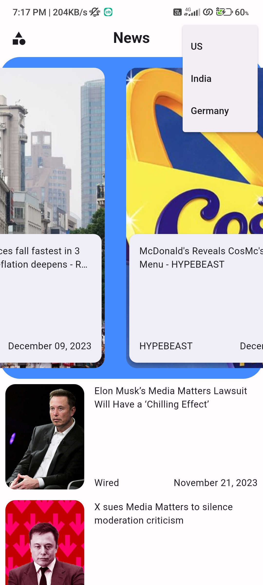

# News App
A Flutter-based News app with three main pages providing top headlines by country and category. Powered by HTTP calls to keep users informed about the latest news.

# Features

A few resources to get you started if this is your first Flutter project:

- **Top Headlines by Country**: Explore the latest news headlines specific to a country.
- **Top Headlines by Category**: Stay updated on news in various categories such as technology, sports, entertainment, and more.
- **User-Friendly Interface**: Intuitive design for easy navigation and a pleasant user experience.
- **HTTP API Integration**: Utilizes HTTP calls to fetch real-time news data from external APIs.
Scree

# Screenshots

